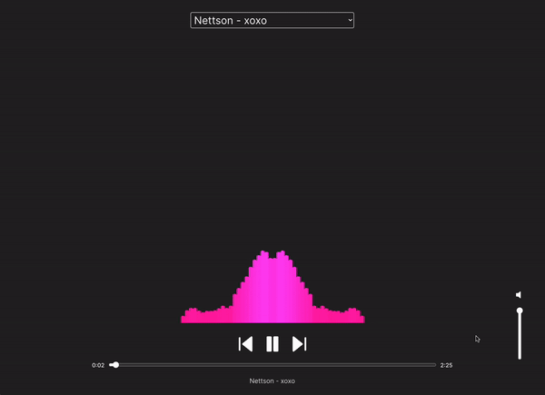

# Music Visualizer using VanJS, TypeScript, and HTML Canvas API

This application utilizes the [VanJS](https://vanjs.org/) reactive framework in combination with TypeScript and the HTML Canvas API to create a dynamic and engaging music visualizer.




## Features

- **Song Selector**: Easily choose from a set of songs using an HTML select element.
- **Play/Pause Toggle**: Control music playback.
- **Next & Previous Buttons**: Navigate through the song array. If a song has played for more than 5 seconds and the previous button is clicked, it will rewind to the beginning.
- **Volume Control & Mute**: Adjust the volume using a slider, and toggle sound with the mute button. The mute icon updates based on volume status.
- **Seek-bar Slider**: Jump to any part of the track.
- **Track Details**: View the artist name and song title at the bottom of the visualizer.
- **Interactive Visualizer**: Experience a dynamic canvas that moves with the frequency of the music. The app leverages the audio context library and adjusts the fftSize based on the screen size.

## Tracks

All tracks used in this visualizer are under Creative Commons license conditions:

- [Nettson - xoxo](https://soundcloud.com/nettson/nettson-xoxo-official)
- [J.A.K - ocean ave](https://soundcloud.com/vgl9/afternoon)
- [Vlad Gluschenko - Afternoon](https://soundcloud.com/arkadenmusicofficial/ocean-ave-1)

## Installation & Setup

1. Clone the repository:
    ```bash
    git clone https://github.com/barrymun/music-visualizer-v2.git
    ```

2. Navigate to the cloned directory:
    ```bash
    cd music-visualizer-v2
    ```

3. Install dependencies:
    ```bash
    yarn install
    ```

4. Start the development server:
    ```bash
    yarn run dev
    ```

Visit `http://localhost:your-port-number` (the port will be displayed in the console) to experience the visualizer.

## Acknowledgments

Huge thanks to the creators of [VanJS](https://vanjs.org/).

## 📢 Note for Mobile Users

If you are experiencing issues with audio not playing on mobile devices, please ensure your device is not set to silent mode or do not disturb mode. Some devices prevent audio playback in web applications when in these modes. Adjust your device settings and try again.

## License

This project is licensed under the MIT License. For detailed information, see the [LICENSE](./LICENSE) file in the root directory.
